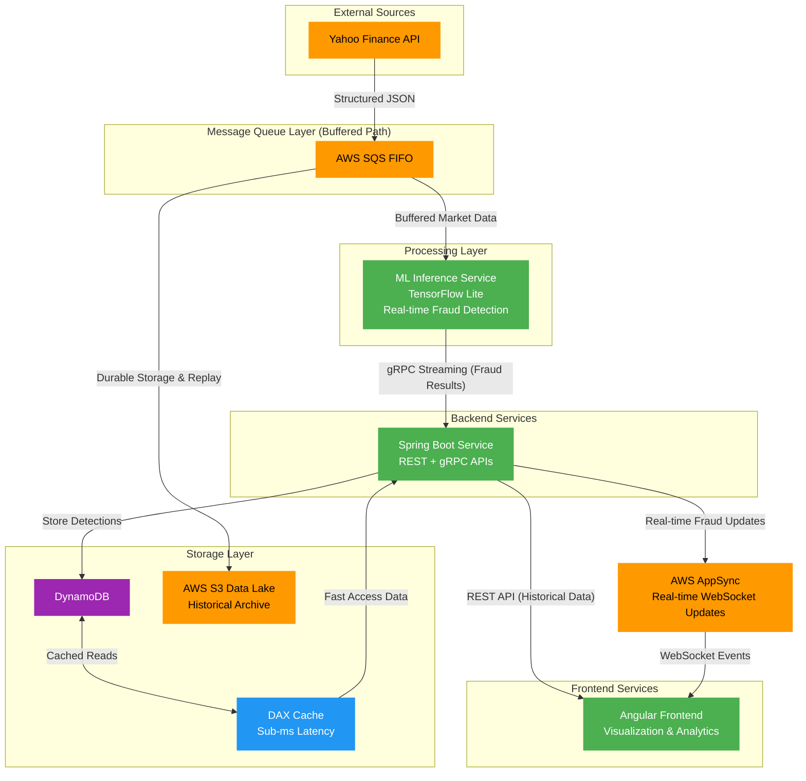

# Real-Time Stock Market Fraud Detection System

## Project Overview

This system demonstrates a complete real-time fraud detection pipeline for stock market data, utilizing AWS services for scalability and reliability. The architecture processes live market data streams, applies ML-based fraud detection, and provides real-time alerts to end users.

## Architecture Flow



## System Components

### Data Ingestion

- **Yahoo Finance API**: Streams near-real-time stock market data with ~15-minute delay
- **Format**: Structured JSON market data
- **Purpose**: Live simulation for demonstrating streaming and inference capabilities

### Message Queue Layer

- **AWS SQS FIFO**: Provides buffering, reliable delivery, and fan-out capabilities
- **Benefits**: Eliminates need for separate ingestion/parsing microservices
- **Guarantees**: Message ordering and exactly-once delivery

### ML Inference Service

- **Platform**: Python service deployed on ECS Fargate
- **Model**: TensorFlow Lite optimized for CPU-only inference
- **Function**: Real-time fraud detection on streaming market data
- **Deployment**: Containerized for scalability and portability

### Backend Services

- **Framework**: Spring Boot running on ECS Fargate
- **Communication**: gRPC for low-latency ML service integration
- **APIs**: REST endpoints for frontend integration
- **Role**: Orchestration and business logic layer

### Storage Layer

- **DynamoDB**: Primary storage for confirmed fraud detections
- **DAX Cache**: Sub-millisecond query performance for high-speed lookups
- **S3 Data Lake**: Historical archive for compliance and ML model retraining

### Frontend & Real-time Updates

- **Angular Frontend**: Visualization dashboard for analytics and reporting
- **AWS AppSync**: WebSocket-based real-time fraud alerts
- **Target Users**: Traders and compliance teams for immediate action

## Model Performance

The fraud detection system uses an ensemble approach combining a supervised classifier with an unsupervised autoencoder for robust anomaly detection:

### Ensemble Model Results

**Detects**: Suspicious trading patterns and market manipulation

| Class                | Precision | Recall | F1-Score   | Support |
| -------------------- | --------- | ------ | ---------- | ------- |
| Normal (0)           | 1.00      | 0.97   | 0.99       | 30,904  |
| Fraud (1)            | 0.38      | 0.99   | 0.55       | 483     |
| **Overall Accuracy** |           |        | **0.97**   | 31,387  |
| **AUC Score**        |           |        | **0.9962** |         |

### Individual Component Performance

**Classifier Only**: AUC 0.9971, F1 0.58 (fraud class)  
**Autoencoder Only**: Pure anomaly detection with 90% fraud recall  
**Optimized Ensemble**: 87.23% F1-score with balanced weights (AE=0.6, CLF=0.4)

The ensemble model achieves excellent fraud detection (99% recall) while maintaining high overall accuracy, making it suitable for real-time market surveillance where missing fraud cases is more costly than false positives.

## Implementation Status

### Completed

- [x] **ML Model Training**: Fraud detection model trained and ready for deployment

### Planned Implementation

- [ ] **Spring Boot Backend** (Java)

  - REST API endpoints
  - gRPC service integration
  - DynamoDB operations
  - AppSync integration

- [ ] **Python ML Inference Service**

  - TensorFlow Lite model deployment
  - SQS consumer implementation
  - gRPC client for backend communication
  - ECS Fargate containerization

- [ ] **Angular Frontend**
  - Analytics dashboard
  - Real-time alert visualization
  - Historical data reporting
  - WebSocket integration

## Technology Stack

| Layer            | Technology               | Purpose                      |
| ---------------- | ------------------------ | ---------------------------- |
| **Data Source**  | Yahoo Finance API        | Market data ingestion        |
| **Queue**        | AWS SQS FIFO             | Message buffering & delivery |
| **ML Inference** | Python + TensorFlow Lite | Fraud detection              |
| **Backend**      | Spring Boot + Java       | API & orchestration          |
| **Database**     | DynamoDB + DAX           | Storage & caching            |
| **Archive**      | Amazon S3                | Data lake                    |
| **Real-time**    | AWS AppSync              | WebSocket alerts             |
| **Frontend**     | Angular                  | User interface               |
| **Deployment**   | ECS Fargate              | Containerized services       |

## Getting Started

Currently, only the ML model training component is available. Additional components will be added as development progresses.

### Prerequisites

- **WSL2 (Windows Subsystem for Linux)**: Required for TensorFlow as GPU library support for native Windows was dropped
- AWS Account with appropriate IAM permissions
- Docker for containerization
- Node.js for Angular development
- Java 11+ for Spring Boot backend
- Python 3.13+ for ML service

### Setup Instructions

#### Python Environment Setup

1. **Navigate to the Python directory:**

   ```bash
   cd python/
   ```

2. **Create and activate a virtual environment:**

   ```bash
   python -m venv venv
   source venv/bin/activate  # On WSL2/Linux
   ```

3. **Install dependencies:**
   ```bash
   pip install -r requirements.txt
   ```

#### Dataset Setup (Required for Model Retraining)

If you need to retrain the ML models, download the required dataset:

1. **Download the Stock Market Dataset from Kaggle:**

- Visit [Stock Market Dataset by Oleh Onyshchak](https://www.kaggle.com/datasets/jacksoncrow/stock-market-dataset){:target="\_blank"}
  - Download and unzip the dataset

2. **Place the dataset in the correct location:**

   ```bash
   # Ensure the unzipped dataset files are placed in:
   python/data/
   ```

   The `python/data/` folder should contain the market data files needed for training.
